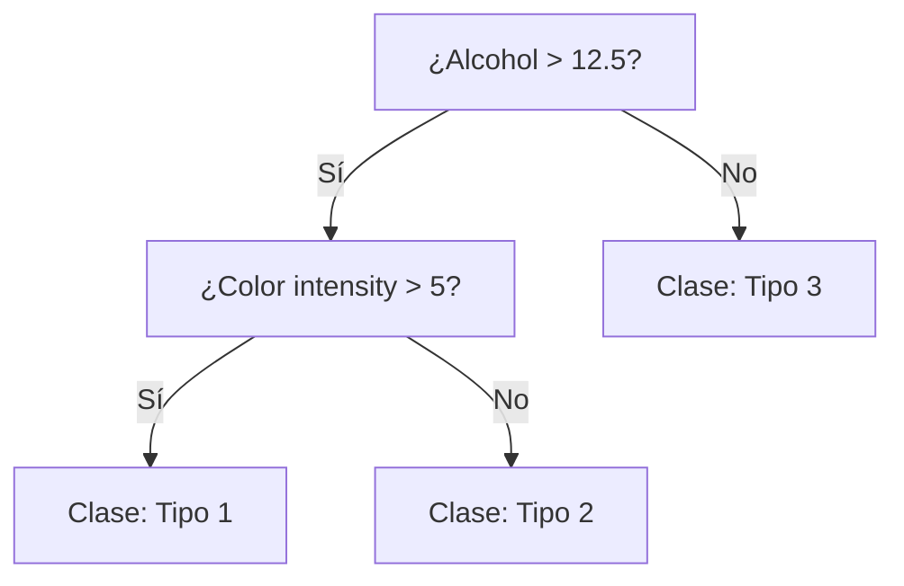
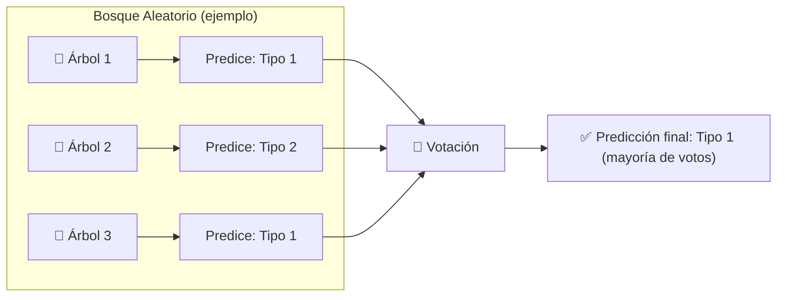
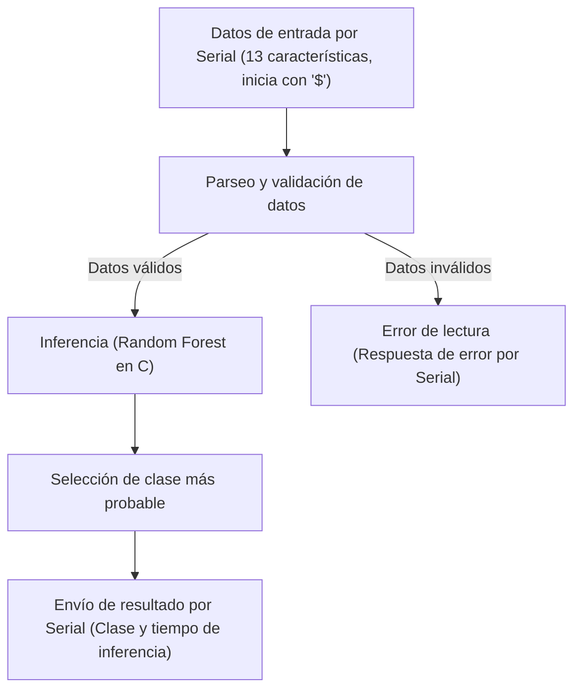

# Implementación de un clasificador de bosque aleatorio en un microcontrolador

En este respositorio:
1. Entrenamos un **Random Forest** con el [conjunto de datos *Wine*](https://archive.ics.uci.edu/dataset/109/wine).  
2. Exportamos el modelo a **código C** usando `m2cgen`, para poder ejecutarlo en microcontroladores (TinyML).  

Este flujo es un ejemplo de cómo pasar de un modelo entrenado con Scikit-Learn (Python) a una implementación que corre en hardware con recursos limitados. Por simplicidad, el modelo en C correrá en el framwork de Arduino, pero la implementación es porteable a cualquier otro framework o modelo de microcontrolador; sólo hay que usar la función de clasificación del header *random_forest_model.h* y archivo que contiene el código del modelo *random_forest_model.c*.

**Clonar repo** ([Instalar git](https://git-scm.com/downloads/win) si no lo has hecho)
```Bash
git clone https://github.com/rescurib/random_forest_arduino_uno.git
```

**Crear y activar entorno virtual de Python** 
Abrir una ventana de comandos dentro de la carpeta del repo y ejecutar:
```Bash
# En Windows
setup_env.cmd

# En Linux
./setup_env.sh
```

## Introducción

Los **bosques aleatorios** (*Random Forests*) son uno de los algoritmos más populares y robustos del aprendizaje automático. Pueden usarse tanto en problemas de **clasificación** como de **regresión** y se basan en la idea de combinar muchos **árboles de decisión** para obtener una predicción más estable y precisa.

### 🌿 ¿Qué es un Árbol de Decisión?

Un **árbol de decisión** es un modelo que representa decisiones y sus posibles consecuencias mediante una estructura en forma de árbol. Cada **nodo** corresponde a una pregunta sobre una característica, por ejemplo, en el caso de la clasificación de vinos: "*¿alcohol > 12.5*?". Cada **hoja** contiene la predicción final (por ejemplo, "Clase: Tipo 1").



Cada uno de los caminos desde la raíz hasta una hoja representa una secuencia de decisiones que lleva a una clasificación.

### 🌲 ¿Qué es un Bosque Aleatorio?

Un **bosque aleatorio** es un conjunto (*ensamble*) de muchos árboles de decisión entrenados con inicializaciones aleatorías. Las dos fuentes principales de aleatoriedad son:

- **Bootstrap (bagging):** cada árbol se entrena con una muestra aleatoria (con reemplazo) del conjunto de entrenamiento.  
- **Selección aleatoria de características:** en cada división, el árbol considera únicamente un subconjunto aleatorio de las características.

Esta combinación produce modelos con **menos varianza** que un único árbol profundo y reduce el riesgo de **sobreajuste**.



## ⚙️ Ventajas y Consideraciones

**Ventajas**
- Robusto al ruido y a valores atípicos.  
- Reduce el sobreajuste respecto a árboles individuales.  
- Puede manejar datos con características de distinta escala.  
- Permite obtener medidas de importancia de características.  
- Fácil de usar con bibliotecas como **scikit-learn**.

**Consideraciones**
- Pierde algo de interpretabilidad frente a un único árbol (aunque aún se pueden inspeccionar árboles individuales).  
- Modelos grandes pueden consumir más memoria y tiempo; para TinyML es común **podar** o convertir el modelo a una versión optimizada en C/C++.

## Creación y entrenamiento del modelo

```Python
from sklearn.datasets import load_wine
from sklearn.ensemble import RandomForestClassifier
from sklearn.model_selection import train_test_split
from sklearn.metrics import accuracy_score

# Cargar el dataset Wine
data = load_wine()
X = data.data
y = data.target

# Dividir en conjunto de entrenamiento y prueba
X_train, X_test, y_train, y_test = train_test_split(
        X, y, test_size=0.2, random_state=42
        )

# Crear y entrenar el modelo Random Forest
clf = RandomForestClassifier(n_estimators=10, max_depth=5, random_state=42)
clf.fit(X_train, y_train)

# Evaluar el modelo
y_pred = clf.predict(X_test)
acc = accuracy_score(y_test, y_pred)
print(f"Exactitud del modelo: {acc:.2f}")
print("Número de árboles entrenados:", len(clf.estimators_))
```

**Salida**
```Bash
Exactitud del modelo: 0.97
Número de árboles entrenados: 10
```

## Exportar modelo a código en C

```Python
import m2cgen as m2c

# Generar código C a partir del modelo
c_code = m2c.export_to_c(clf)

# Guardar el código generado en un archivo .c
with open("random_forest_model.c", "w") as f:
    f.write("/*\n")
    f.write(" * Random Forest generado con m2cgen\n")
    f.write(f" * Exactitud en test: {acc:.2f}\n")
    f.write(" */\n\n")
    f.write(c_code)
```

La función `score()` es el punto de entrada para realizar la inferencia con el modelo Random Forest exportado a C. Recibe un arreglo de 13 valores tipo `double` (las características de entrada) y devuelve en un arreglo de 3 valores las probabilidades para cada clase. Hay que tener cuidado porque la implementación no verifica tamaños de arreglos.

**Ejemplo de uso en C:**

```c
double features[13] = { /* tus valores de entrada */ };
double output[3];
score(features, output);
// output[0], output[1], output[2] contienen la probabilidad de cada clase
```

## Ejecución del modelo en Arduino

El programa en Arduino espera recibir por el puerto serie una línea con 13 características numéricas (del dataset Wine), realiza la inferencia usando el modelo Random Forest exportado a C y responde por el mismo puerto la clase predicha y el tiempo de inferencia.

### Esquema general del flujo



### Detalles del protocolo de comunicación

**Entrada:**

- Formato:
    ```text
    $<f1>,<f2>,...,<f13>\n
    # 13 valores tipo float/double separados por coma, inicia con '$'
    ```
- Ejemplo:
    ```text
    $13.2,2.7,2.5,15.6,98.0,2.1,2.0,0.3,1.6,5.1,1.1,3.0,1065.0\n
    # Cada número representa una característica del dataset Wine
    ```

**Salida:**

- Si la inferencia es exitosa:
    ```text
    Clase más probable: <clase>
    Tiempo de inferencia (us): <tiempo>
    ```

Si compiamos y pegamos esta muestra en el monitor serial del IDE de Arduino este es el resultado:
```Bash
Clase más probable: 1
Tiempo de inferencia (us): 428
```

## Programa de envío de muestra

Una vez que hayas cargado el programa en el Arduino, ajusta el número de puerto COM en `clasificador_serial_arduino.py`. Este programa selecciona un elemento aleatorio del conjunto Wine, lo envía al Arduino por serial y evalua su respuesta.
Para ejecutarlo:
```Bash
python clasificador_serial_arduino.py

# En Windows tal vez tengas que usar:
py clasificador_serial_arduino.py
```