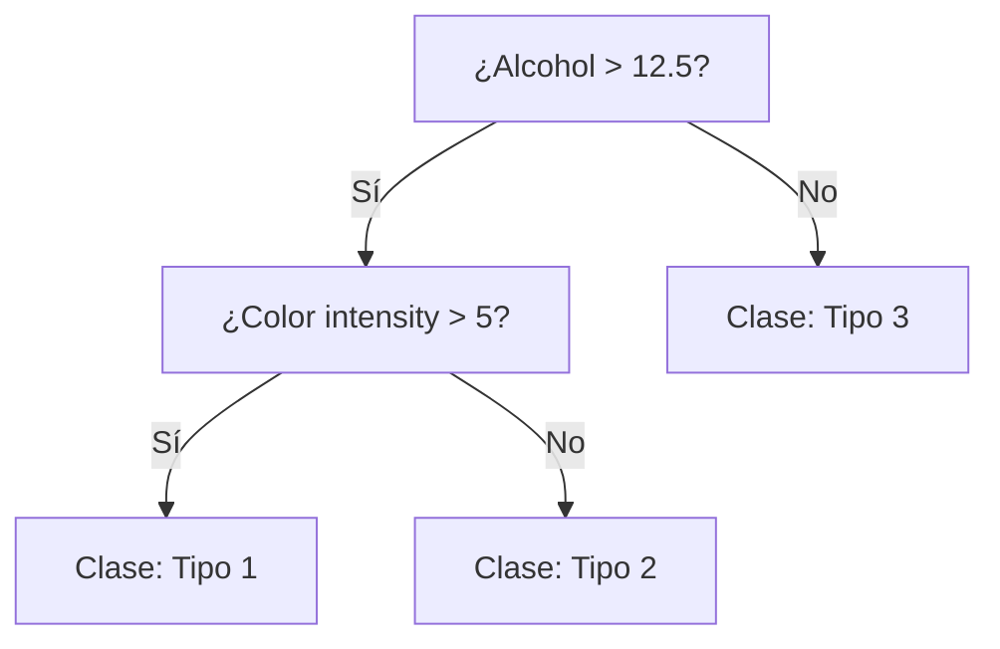
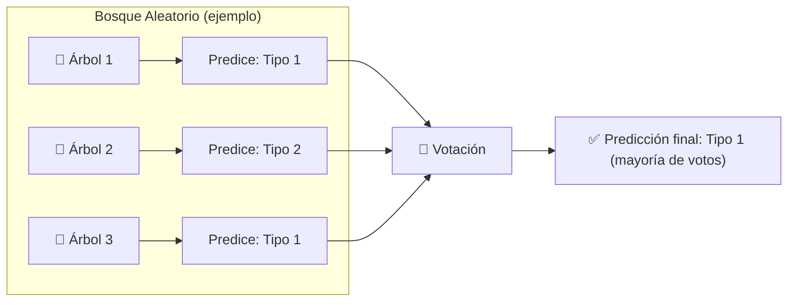

# Implementación de un clasificador de bosque aleatorio en un microcontrolador

En este respositorio:
1. Entrenamos un **Random Forest** con el *Wine Dataset* (UCI).  
2. Exportamos el modelo a **código C** usando `m2cgen`, para poder ejecutarlo en microcontroladores (TinyML).  

Este flujo es un ejemplo de cómo pasar de un modelo entrenado con Scikit-Learn (Python) a una implementación que corre en hardware con recursos limitados. Por simplicidad, el modelo en C correrá en el framwork de Arduino, pero la implementación es porteable a cualquier otro framework o modelo de microcontrolador.

## Introducción

Los **bosques aleatorios** (*Random Forests*) son uno de los algoritmos más populares y robustos del aprendizaje automático. Pueden usarse tanto en problemas de **clasificación** como de **regresión** y se basan en la idea de combinar muchos **árboles de decisión** para obtener una predicción más estable y precisa.

### 🌿 ¿Qué es un Árbol de Decisión?

Un **árbol de decisión** es un modelo que representa decisiones y sus posibles consecuencias mediante una estructura en forma de árbol. Cada **nodo** corresponde a una pregunta sobre una característica, por ejemplo, en el caso de la clasificación de vinos: "*¿alcohol > 12.5*?". Cada **hoja** contiene la predicción final (por ejemplo, "Clase: Tipo 1").

Cada uno de los caminos desde la raíz hasta una hoja representa una secuencia de decisiones que lleva a una clasificación.

### 🌲 ¿Qué es un Bosque Aleatorio?

Un **bosque aleatorio** es un conjunto (*ensamble*) de muchos árboles de decisión entrenados con inicializaciones aleatorías. Las dos fuentes principales de aleatoriedad son:

- **Bootstrap (bagging):** cada árbol se entrena con una muestra aleatoria (con reemplazo) del conjunto de entrenamiento.  
- **Selección aleatoria de características:** en cada división, el árbol considera únicamente un subconjunto aleatorio de las características.

Esta combinación produce modelos con **menos varianza** que un único árbol profundo y reduce el riesgo de **sobreajuste**.

---

## ⚙️ Ventajas y Consideraciones

**Ventajas**
- Robusto al ruido y a valores atípicos.  
- Reduce el sobreajuste respecto a árboles individuales.  
- Puede manejar datos con características de distinta escala.  
- Permite obtener medidas de importancia de características.  
- Fácil de usar con bibliotecas como **scikit-learn**.

**Consideraciones**
- Pierde algo de interpretabilidad frente a un único árbol (aunque aún se pueden inspeccionar árboles individuales).  
- Modelos grandes pueden consumir más memoria y tiempo; para TinyML es común **podar** o convertir el modelo a una versión optimizada en C/C++.

## 📚 Referencias
- Breiman, L. (2001). *Random Forests*. Machine Learning.  
- Documentación de scikit-learn: `RandomForestClassifier`.  
- m2cgen: generador de código para modelos (útil para TinyML).
